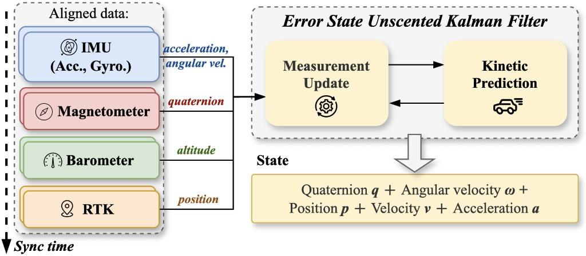
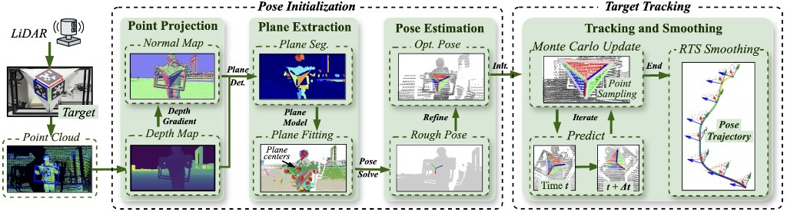

# SYNOVA Pose Estimation Toolkit

**Multi-sensor online fusion & LiDAR-based offline ground-truth tracking**

*Software toolkit for the SYNOVA collaborative sensing platform (see project paper for full system design).*

  


| Online                              | Offline                      |
| ----------------------------------- | ---------------------------- |
| Runtime 6-DoF pose on sync timeline | Ground-truth pose estimation |


---

## Overview

This `tracker` package implements the **pose estimation software stack** described in **SYNOVA**, covering:

1. **Online pose estimation (§6.2)** — fuse time-aligned IMU, RTK-GNSS, magnetometer, and optional vision measurements through a shared **Error-State Unscented Kalman Filter (ES-UKF)** backbone.
2. **Offline ground-truth pose (§6.3)** — track a custom **trihedral LiDAR target** with pose initialization, **Monte Carlo UKF (MC-UKF)** beam-wise updates, **bidirectional** forward/backward passes, and **Rauch–Tung–Striebel (RTS)** smoothing.

---

## Online multi-sensor fusion

Aligned sensor streams drive alternating **measurement updates** and **kinetic prediction** inside the ES-UKF. The filter state can include orientation **q**, angular rate **ω**, position **p**, velocity **v**, acceleration **a**, and higher-order motion terms depending on the active trackers.


***Fig. 1** — Online ES-UKF pipeline (SYNOVA §6.2). IMU / RTK / magnetometer / barometer are fused on a unified sync timeline.*

### What the code implements


| Module                                     | Role                                                                                           |
| ------------------------------------------ | ---------------------------------------------------------------------------------------------- |
| `[tracker.py](tracker.py)`                 | Core `Tracker`: unscented prediction, per-sensor updates, **RTS** `smooth()` / `smooth_step()` |
| `[imu/imu_tracker.py](imu/imu_tracker.py)` | Accelerometer + gyroscope updates; jerk/snap augmented prediction when IMU is active           |
| `[rtk/rtk_tracker.py](rtk/rtk_tracker.py)` | RTK position in NED with **IMU↔antenna lever arm** (`[parameters.Extrinsics](parameters.py)`)  |
| `[mag/mag_tracker.py](mag/mag_tracker.py)` | Magnetometer heading via declination model                                                     |
| `[parameters.py](parameters.py)`           | Intrinsics, extrinsics, process & measurement noise                                            |
| `[sync_parser.py](sync_parser.py)`         | Parse sync-unit messages (`SECON`, `CAPIN`, `TROUT`, `PULSE`, `UTCIN`, `HOST`)                 |


**Parsers** (`[msg_data_parser.py](msg_data_parser.py)`, `*_parser.py`) turn `.log` recordings into typed `namedtuple` frames for fusion or analysis.

## Offline LiDAR ground-truth tracking

For dataset evaluation and mapping, we track a rigid **three-plane trihedral target** in point clouds. The pipeline matches **SYNOVA Figure 9** and §6.3: initialize pose from geometry, track online per scan, then refine with RTS smoothing.


***Fig. 2** — Offline LiDAR pipeline (cf. **Figure 9** in the SYNOVA paper): projection & plane extraction → pose init → MC-UKF tracking → RTS smoothing.*

### Pipeline ↔ source files


| Stage                   | Paper concept                                                          | Implementation                                                                                            |
| ----------------------- | ---------------------------------------------------------------------- | --------------------------------------------------------------------------------------------------------- |
| **Pose initialization** | Depth/normal maps, plane segmentation & fitting, trihedral association | `[lidar/target_finder.py](lidar/target_finder.py)` — `rough_estimate_lidar_target`, `refine_lidar_target` |
| **Target model**        | Known trihedral geometry                                               | `[lidar/lidar_target.py](lidar/lidar_target.py)`                                                          |
| **Forward tracking**    | MC-UKF predict + beam-wise update                                      | `[lidar/lidar.py](lidar/lidar.py)` → `run_tracking(..., backward_track=False)`                            |
| **Backward tracking**   | Reverse-time pass for symmetric information                            | `run_tracking(..., backward_track=True)`                                                                  |
| **RTS smoothing**       | Offline backward pass on the full trajectory                           | `[tracker.py](tracker.py)` `smooth()` — called after each tracking leg in `lidar.py`                      |
| **Visualization**       | Trajectory & point-cloud replay                                        | `[lidar/lidar_visualization.py](lidar/lidar_visualization.py)`, `LiDARTracker.visualize_`*                |


`[lidar/lidar_tracker.py](lidar/lidar_tracker.py)` implements **MC-UKF** updates: Monte Carlo samples over pose hypotheses, plane-assignment via `LidarTarget`, and Bayesian fusion of range likelihoods—processing points without multi-beam accumulation blur.

**Typical offline flow** (`lidar/lidar.py`):

```
accumulate LVX frames → rough pose → refine pose
        → init LiDARTracker at start_idx
        → backward track + RTS smooth
        → forward track + RTS smooth
        → save .npz / visualize
```

---

## Dependencies

- **Core:** `numpy`, `scipy`, `matplotlib`, `alive-progress`, `opencv-python`
- **LiDAR offline:** `opencv-python`, `torch` (refinement), Livox `.lvx` via `[lvx_reader.py](lidar/lvx_reader.py)`

---

## Quick start

Run from the **repository root** (`RTK-master/`) so `tracker` imports resolve.

### 1. Forward & backward LiDAR tracking

Run `[lidar/lidar.py](lidar/lidar.py)`. A file dialog lets you pick a lidar recording. The pipeline then performs **pose initialization**, **backward tracking**, **forward tracking**, and **RTS smoothing**, and saves a trajectory as `**.npz`** next to the LVX file.

```bash
cd /path/to/RTK-master
python tracker/lidar/lidar.py
```

### 2. Visualize tracking results

Run `[lidar/lidar_visualization.py](lidar/lidar_visualization.py)`. Select the same point cloud file; the script loads the matching `**.npz**` and visualizes the **estimated pose trajectory** and **point-cloud playback** aligned with the track.

```bash
cd /path/to/RTK-master
python tracker/lidar/lidar_visualization.py
```

